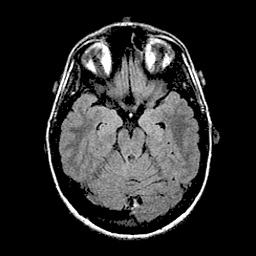
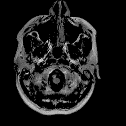
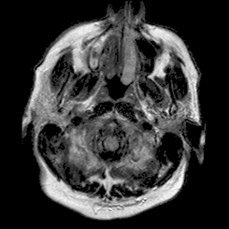
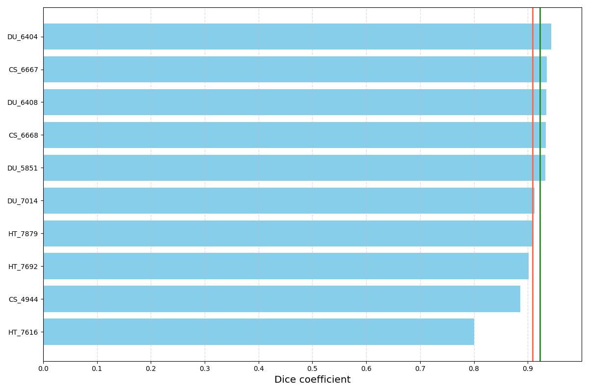

# Bone Marrow Segmentation Web App

Table of Contents :bookmark_tabs:
=================
- [Overview](#overview)
- [Installation](#installation)
- [Data](#data)
- [Model](#model)
- [Results](#results)
- [Steps to Use the Application](#steps-to-use-the-application)
- [Code and Resources Used](#code-and-resources-used)

## Overview
This repository contains code and model to run bone-marrow segmentation. More details will be available soon.

## Installation
- download and install conda for the relevant operating system:
https://docs.conda.io/projects/conda/en/latest/user-guide/install/index.html
- download and install git for the relevant operating system:
https://git-scm.com/book/en/v2/Getting-Started-Installing-Git
- open the conda interperter that was installed
- create a new virtual environment by typing in the interpreter:
```
conda create --name bone_marrow_env python=3.7
```

- activate the new environment by typing in the interpreter:
```
conda activate bone_marrow_env
```

- navigate to the directory where you want to save the files, for example:
```
cd C:\User\myusername\Work
```

- clone the github repository by typing in the interpreter:
```
git clone https://github.com/galbarequet/bonemarrow-segmentation.git
```

- install dependencies by typing in the interpreter:
```
pip install -r requirements.txt
```

- run the webapp by typing in the interpreter:
```
streamlit run bonemarrow_app.py
```

## Data

| raw image | bones mask | fat mask |
|:-------:|:-------:|:-------:|
||||

Dataset used for development and evaluation was made privately by medical research team.


## Model

The segmentation model is a combination of a modified U-Net and DeepLabV3.


## Results

#TODO: fix results

||||
|:-------:|:-------:|:-------:|
| 94% DSC | 91% DSC | 89% DSC |

Qualitative results for validation cases from three different institutions with DSC of 94%, 91%, and 89%.
Green outlines correspond to ground truth and red to model predictions.
Images show FLAIR modality after preprocessing. 



Distribution of DSC for 10 randomly selected validation cases.
The red vertical line corresponds to mean DSC (91%) and the green one to median DSC (92%).
Results may be biased since model selection was based on the mean DSC on these validation cases.

## Steps to Use the Application

For both inference and train, request permissions to download the original dataset and use `scripts/psd_to_layers.py` to generate and convert to a new dataset for next steps.

### inference

- Run `inference.py` script with specified paths to weights and images. Trained weights are provided in `./weights/weights.pt` file. For more options and help run: `python3 inference.py --help`.

### Train

- Run `train.py` script. For more options and help run: `python3 train.py --help`.

### Web App

- Click 'Browse files' and upload an image file in png format

Running this code on a custom dataset would likely require adjustments in `dataset.py`.
Should you need help with this, just open an issue.

## Code and Resources Used
- Python: Version 3.7
- Packages: torchvision, torch, opencv-python, PIL, streamlit, events 
