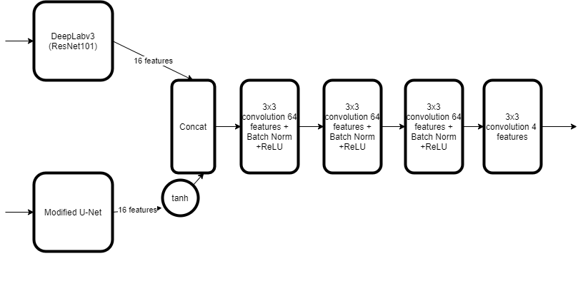
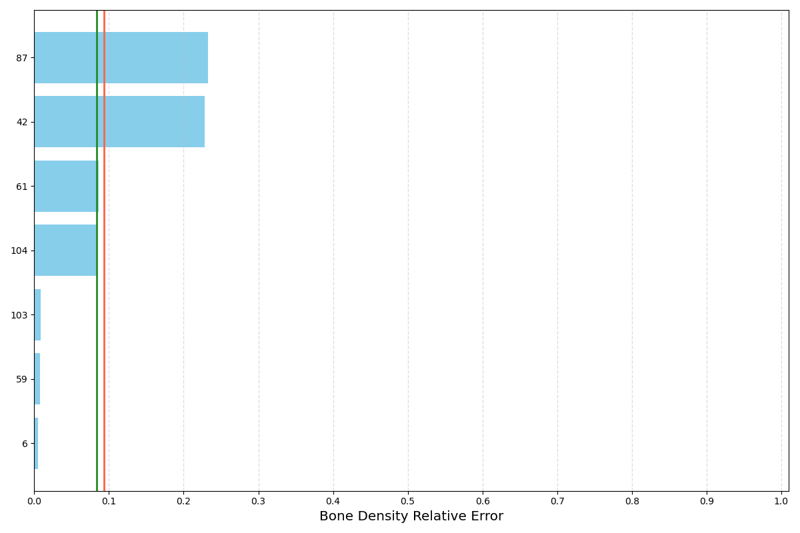
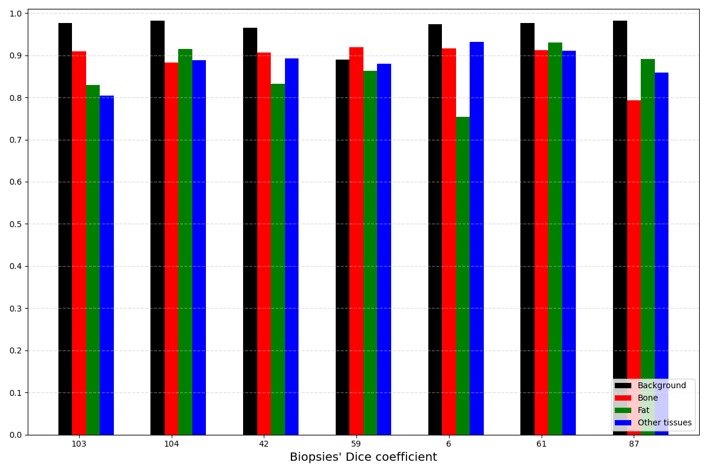

# Bone Marrow Segmentation

Table of Contents :bookmark_tabs:
=================
- [Overview](#overview)
- [Installation](#installation)
- [Data](#data)
- [Model](#model)
- [Results](#results)
- [Steps to Use the Application](#steps-to-use-the-application)
- [Code and Resources Used](#code-and-resources-used)

## Overview
This repository contains code and model to perform segmentation on bone marrow biopsy samples.
Bone marrow segmentation (BMS) is relevant for medical research purposes.
In particular, BMS is used for researching the corelation between the bone density in the biopsy and certain diseases.


## Installation
- download and install conda for the relevant operating system:
https://docs.conda.io/projects/conda/en/latest/user-guide/install/index.html
- download and install git for the relevant operating system:
https://git-scm.com/book/en/v2/Getting-Started-Installing-Git
- open the conda interperter that was installed
- create a new virtual environment by typing in the interpreter:
```
conda create --name bone_marrow_env python=3.7
```

- activate the new environment by typing in the interpreter:
```
conda activate bone_marrow_env
```

- navigate to the directory where you want to save the files, for example:
```
cd C:\User\myusername\Work
```

- clone the github repository by typing in the interpreter:
```
git clone https://github.com/galbarequet/bonemarrow-segmentation.git
```

- install dependencies by typing in the interpreter:
```
pip install -r requirements.txt
```

- run the webapp by typing in the interpreter:
```
streamlit run bonemarrow_app.py
```

## Data

| raw image | bones mask | fat mask |
|:-------:|:-------:|:-------:|
||||

Dataset used for development and evaluation was made privately by medical research team.


## Model

The segmentation model implemented in this repository is an ensemble between:
- modified U-Net as described in [Association of genomic subtypes of lower-grade gliomas with shape features automatically extracted by a deep learning algorithm](https://doi.org/10.1016/j.compbiomed.2019.05.002) with added batch normalization.
- DeepLabv3 with a ResNet101 backbone - more details about the SOTA general semantic segmentation tool can be found in https://pytorch.org/hub/pytorch_vision_deeplabv3_resnet101.




## Results

Over one of the images from the test set the model prediction has 0.53% bone density relative error.
Color meaning is Black for background, red for bone, green for fat, and blue for other tissues. 

Raw image:

Predicted segmentation for the image:


The bone density relative error achieved is:


Distribution of background/bone/fat/other tissue DSC for 7 randomly selected test cases:


The test set consists of 10% of the entire dataset and independent of the training and validation set.
Thus, the results are likely to be unbiased since model selection was based on the minimal bone density relative error for the validation set.


## Steps to Use the Application

For both inference and train, request permissions to download the original dataset and use `scripts/psd_to_layers.py` to generate and convert to a new dataset for next steps.

### inference

- Run `inference.py` script with specified paths to weights and images. Trained weights are provided in `./weights/weights.pt` file. For more options and help run: `python3 inference.py --help`.

### Train

- Run `train.py` script. For more options and help run: `python3 train.py --help`.

### Web App

- Click 'Browse files' and upload an image file in png format

Running this code on a custom dataset would likely require adjustments in `dataset.py`.
Should you need help with this, just open an issue.

## Code and Resources Used
- Python: Version 3.7
- Packages: torchvision, torch, opencv-python, PIL, streamlit, events 
